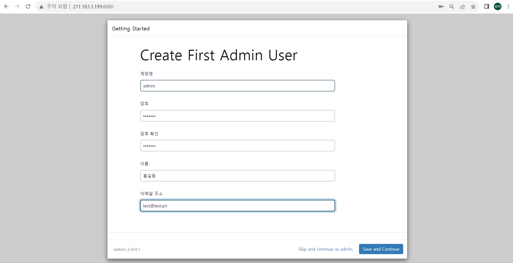

# 젠킨스 설치하기 on ubuntu 20.04 using docker
## 1. 젠킨스 설치 및 접속
```bash
cd ~
docker run -d --name jenkins --restart always -p 8080:8080 -p 50000:50000 -v jenkins_home:/var/jenkins_home jenkins/jenkins:lts-jdk11
docker exec jenkins cat /var/jenkins_home/secrets/initialAdminPassword   # 초기 패스워드 확인
```
http://211.183.3.199:8080 으로 접속하여 앞서 확인한 초기 패스워드 입력 뒤, 계정 정보를 입력(호스트 주소 > 211.183.3.199)



## 2. 젠킨스 설정

